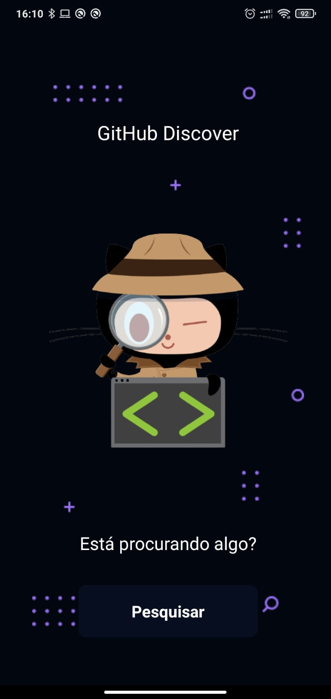
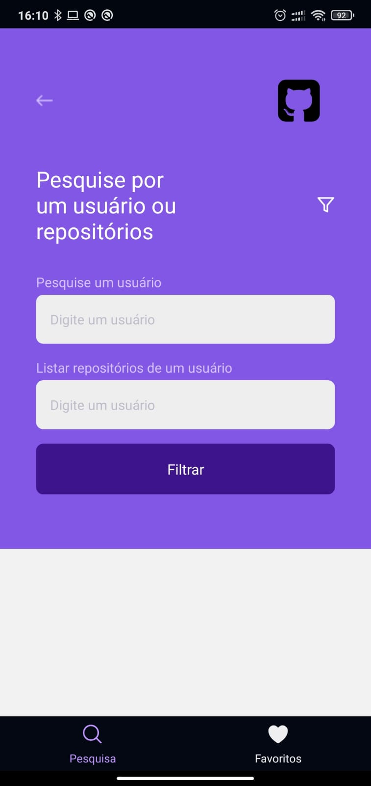
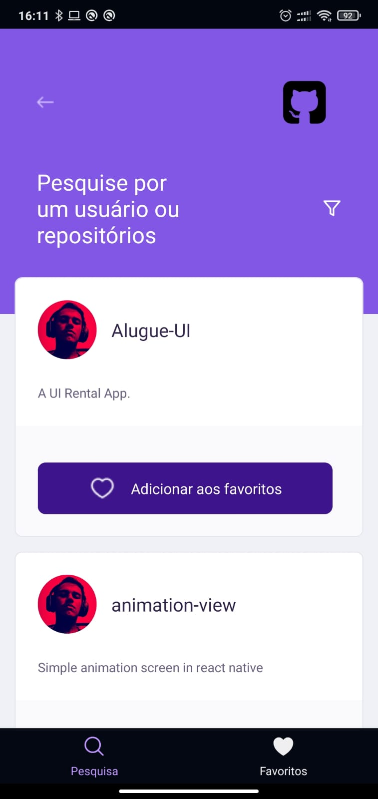
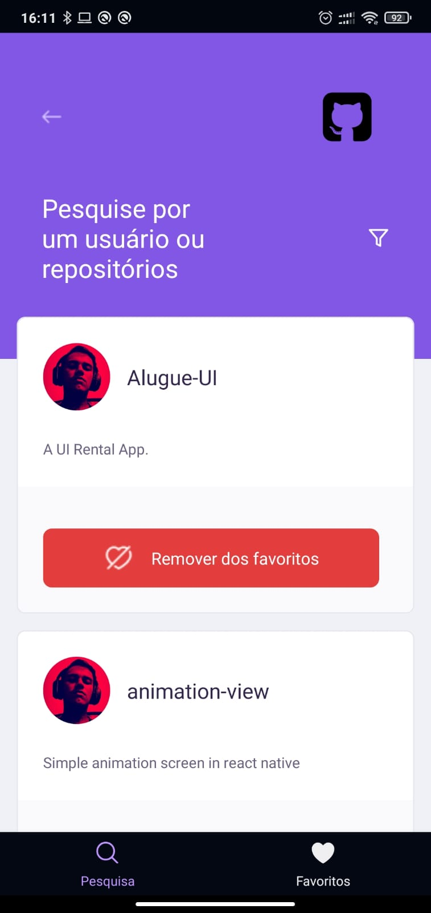

# Pedido Pago Challenge

### O desafio consiste em filtrar e listar usuários ou repositórios. (Github API)

## 👨‍💻 Tecnologias Utilizadas

Esse projeto foi construído utilizando as seguintes tecnologias:


### Mobile

  - [React Native](https://reactnative.dev/)
  
### Dependencies

  - [TypeScript](https://www.typescriptlang.org/)
  - [Styled-Components](https://styled-components.com/)
  - [AsyncStorage](https://docs.expo.io/versions/latest/sdk/async-storage/)

  ## 📦️ Como Clonar e Rodar o Projeto

> [Node.js](https://nodejs.org/en/) and [Yarn](https://yarnpkg.com/) or [NPM](https://www.npmjs.com/) are required

Para clonar o projeto, utilize os comandos:

```bash
  # Clonar o repositório
  ❯ git clone https://github.com/jezielm7/pedido-pago-challenge.git

  # Acessar o repositório
  ❯ cd pedidoPago
```

### Mobile

**IOS**

```bash
  # Instale as dependências
  ❯ yarn

  # Instale as referências do iOS
  ❯ npx pod-install
  
  # Inicie o projeto
  ❯ yarn ios
```

**Android**

```bash
  # Instale as dependências
  ❯ yarn
  
  # Inicie o projeto
  ❯ yarn android
```

## Screenshots 📸

<div>
  
  
  
  
  
  
</div>
